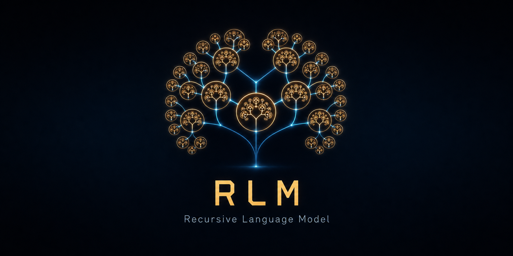

# 🧠 RLM Plugin for Hermes Agent

<p align="center">
  
</p>

[](https://www.python.org/)
[](.)
[](./LICENSE)
[](https://hermes-agent.nousresearch.com)

**Recursive Language Model** — deep recursive analysis instead of shallow RAG search. Works with OpenAI, OpenRouter, vLLM (native) and Ollama (via built-in proxy).

---

## TL;DR

- **RLM vs RAG:** модель сама решает что читать, а не получает готовые куски от векторной БД
- **OpenAI / OpenRouter / vLLM:** нативно, любой `/v1/chat/completions` endpoint
- **Ollama:** через встроенный прокси (zero-dependency, стартует автоматически)
- **Кроссплатформенно:** Linux, macOS, Windows — один скрипт `python3 install.py`
- **Хранится в `~/.hermes/rlm/`:** постоянно, не чистится системой, переживает ребуты
- **Инструмент `rlm_complete`:** агент вызывает когда нужен глубокий анализ
- **Для:** больших документов, сравнения файлов, задач где нельзя ошибиться
- **Не для:** коротких файлов, простых фактов, механических задач
- **Валидация API при установке:** проверяет что endpoint отвечает до записи в .env
- **Фиксированная версия RLM:** pinned commit, не сломается от обновлений upstream
- **Тесты:** `python3 test.py` — проверяет всё после установки

---

## What it does

| | RAG | RLM |
|---|---|---|
| **Who searches** | Vector DB (dumb) | The model itself (smart) |
| **How** | Embedding similarity | Document structure |
| **Completeness** | Top-K chunks — can miss critical info | Can read **everything** |
| **Complex tasks** | Fails on comparison, cross-analysis | Handles naturally |

RLM works like a human researcher: open document → scan structure → find relevant sections → compare → synthesize. The model decides what to read, in what order, where to go back, what to cross-check.

```
┌──────────────────────────────────────────────────────────┐
│                                                          │
│                      R L M   F L O W                     │
│                                                          │
│   User: "Compare liability clauses in 3 contracts"       │
│                                                          │
│   RLM:                                                   │
│     ├─ Read contract A  →  find "Responsibility"         │
│     ├─ Read contract B  →  find "Liability"               │
│     ├─ Read contract C  →  find "Penalties"               │
│     ├─ Cross-reference all three                         │
│     └─ Synthesize: "A has X, B has Y, C has Z"           │
│                                                          │
│   RAG would:                                             │
│     └─ Search "liability" → return chunks → miss the     │
│        "penalties" section entirely                      │
│                                                          │
└──────────────────────────────────────────────────────────┘
```

**Use for:**
- Analyzing large documents (500+ lines)
- Comparing multiple files/contracts/specs
- Tasks where "missing one piece = disaster"
- Deep research with cross-references

**Don't use for:**
- Short files (<200 lines) — regular `read_file` is faster
- Simple facts — `web_search` is faster
- Mechanical tasks (git, deploy) — `terminal` is faster

---

## Quick Install

**Linux / macOS / Windows — one command:**

```bash
python3 install.py
```

Or directly from GitHub:

```bash
# Linux / macOS
curl -O https://raw.githubusercontent.com/defdis/rlm-hermes-plugin/main/install.py
python3 install.py

# Windows (PowerShell)
Invoke-WebRequest -Uri https://raw.githubusercontent.com/defdis/rlm-hermes-plugin/main/install.py -OutFile install.py
python install.py
```

The installer will:
1. Check Python 3.11+, git, and Hermes
2. Ask for API credentials — OpenAI-compatible endpoint **or** Ollama URL
3. **Validate the API** — checks endpoint responds before saving
4. Clone and install the RLM library (**pinned commit** — won't break on upstream updates)
5. Create the Hermes plugin (copies `__init__.py`, `plugin.yaml`, `proxy.py`, `SKILL.md`)
6. Prompt you to restart Hermes

**Cross-platform:** works on Linux, macOS, and Windows. No bash required.

---

## Verify

After install, run the smoke test:

```bash
python3 test.py
```

Or ask your agent: **"Compare RAG and RLM in 3 bullet points."**

If it responds meaningfully — it works. (The agent needs `SKILL.md` loaded — restart Hermes first.)

---

## Requirements

### For RLM itself
- **Python 3.11+** — RLM library requires it
- **git** — to clone `alexzhang13/rlm`
- **Hermes Agent** — any version with plugin support

### For the API backend (pick one)

**OpenAI-compatible (native):**
- OpenAI API key (`sk-...`) or OpenRouter key (`sk-or-...`)
- Endpoint serving `/v1/chat/completions`
- Sufficient token budget — RLM makes multiple iterations per task

**Ollama (via built-in proxy):**
- Ollama instance — local (`localhost:11434`) or cloud
- `OLLAMA_API_KEY` — only needed for Ollama Cloud; local Ollama is auth-free
- Proxy runs on Python 3.9+ (stdlib only, no extra deps)

---

## Supported API Providers

| Provider | Base URL | Mode |
|---|---|---|
| OpenAI | `https://api.openai.com/v1` | Native |
| OpenRouter | `https://openrouter.ai/api/v1` | Native |
| vLLM | `http://your-server:8000/v1` | Native |
| Any `/v1/chat/completions` | your endpoint | Native |
| **Ollama** (local) | `http://localhost:11434` | Via built-in proxy |
| **Ollama Cloud** | `https://*.ollama.com` | Via built-in proxy |

### OpenAI / OpenRouter / vLLM — Native

```bash
# ~/.hermes/.env
RLM_OPENAI_BASE_URL=https://api.openai.com/v1       # or OpenRouter / vLLM
RLM_OPENAI_API_KEY=sk-...                            # your API key
RLM_MODEL=gpt-4o                                     # or claude-sonnet-4, etc.
```

### Ollama — Via Built-in Proxy

RLM doesn't support Ollama natively (Ollama uses `/api/chat`, not `/v1/chat/completions`). The plugin includes `proxy.py` — a zero-dependency OpenAI→Ollama translator that starts automatically on first `rlm_complete` call.

**Local Ollama:**

```bash
# ~/.hermes/.env
RLM_BACKEND=ollama
RLM_OLLAMA_URL=http://localhost:11434
RLM_MODEL=qwen3.5:122b
# No API key needed
```

**Ollama Cloud:**

```bash
# ~/.hermes/.env
RLM_BACKEND=ollama
RLM_OLLAMA_URL=https://your-instance.ollama.com
OLLAMA_API_KEY=your_ollama_cloud_key
RLM_MODEL=deepseek-v4-pro
```

The proxy starts on `127.0.0.1:11435`, translates `/v1/chat/completions` → `/api/chat`, and forwards `Authorization: Bearer <key>` to Ollama Cloud.

**Manual proxy (optional):**

```bash
python3 proxy.py --port 11435 --ollama-url http://your-ollama:11434
# Then set RLM_OPENAI_BASE_URL=http://127.0.0.1:11435/v1
```

---

## Manual Install

### 1. Install RLM library (pinned commit)

```bash
# Linux / macOS
mkdir -p ~/.hermes/rlm
git clone https://github.com/alexzhang13/rlm.git ~/.hermes/rlm/repo
git -C ~/.hermes/rlm/repo checkout 156fd725411b9cae822f5920a6cbf102a5473baa
python3.12 -m venv ~/.hermes/rlm/.venv
~/.hermes/rlm/.venv/bin/pip install -e ~/.hermes/rlm/repo

# Windows
mkdir %USERPROFILE%\.hermes\rlm
git clone https://github.com/alexzhang13/rlm.git %USERPROFILE%\.hermes\rlm\repo
git -C %USERPROFILE%\.hermes\rlm\repo checkout 156fd725411b9cae822f5920a6cbf102a5473baa
python -m venv %USERPROFILE%\.hermes\rlm\.venv
%USERPROFILE%\.hermes\rlm\.venv\Scripts\pip install -e %USERPROFILE%\.hermes\rlm\repo
```

### 2. Configure environment

**OpenAI / OpenRouter / vLLM:**

```bash
# ~/.hermes/.env
RLM_OPENAI_BASE_URL=https://api.openai.com/v1
RLM_OPENAI_API_KEY=sk-...
RLM_MODEL=gpt-4o
```

**Ollama (local):**

```bash
# ~/.hermes/.env
RLM_BACKEND=ollama
RLM_OLLAMA_URL=http://localhost:11434
RLM_MODEL=qwen3.5:122b
```

**Ollama Cloud:**

```bash
# ~/.hermes/.env
RLM_BACKEND=ollama
RLM_OLLAMA_URL=https://your-instance.ollama.com
OLLAMA_API_KEY=your_ollama_cloud_key
RLM_MODEL=deepseek-v4-pro
```

### 3. Create plugin

```bash
mkdir -p ~/.hermes/plugins/rlm
cp __init__.py ~/.hermes/plugins/rlm/__init__.py
cp plugin.yaml ~/.hermes/plugins/rlm/plugin.yaml
cp proxy.py ~/.hermes/plugins/rlm/proxy.py
cp skills/rlm-deep-analysis/SKILL.md ~/.hermes/plugins/rlm/SKILL.md
```

### 4. Restart Hermes

Restart your Hermes agent so it loads the new plugin:

- **If Hermes runs as a service:** `systemctl --user restart hermes-gateway-*.service`
- **If Hermes runs in terminal:** stop it (Ctrl+C) and start again
- **Or from within Hermes chat:** send `/restart` command

---

## How it works

The plugin registers a `rlm_complete` tool in Hermes. When called:

1. Hermes agent passes the task to RLM
2. If Ollama backend detected → built-in proxy starts on `127.0.0.1:11435`
3. RLM spawns a Python REPL environment
4. The model recursively explores: reads, asks sub-questions, cross-references
5. Returns a synthesized answer

**Security:** prompt is passed via stdin as JSON — safe from injection. No string escaping into Python code.

---

## Notes

- RLM in local mode cannot read files directly — pass content in the prompt
- Each iteration consumes tokens — use regular tools for simple tasks
- `model_name` in `backend_kwargs` is required
- `result.response` (not `.answer`) contains the final answer
- **OpenAI / OpenRouter / vLLM:** native — just set `RLM_OPENAI_BASE_URL` + `RLM_OPENAI_API_KEY`
- **Ollama:** via built-in proxy — set `RLM_BACKEND=ollama` + `RLM_OLLAMA_URL` (+ `OLLAMA_API_KEY` for cloud)
- **Pinned RLM commit:** `156fd72` — won't break on upstream API changes
- **API validated at install time** — catches bad credentials before they hit .env
- **Timeout default 300s** (5 min) — increase for very complex tasks
- **Proxy requires Python 3.9+** (stdlib only) — separate from RLM's 3.11+ requirement

---

## Uninstall

```bash
# Linux / macOS
rm -rf ~/.hermes/plugins/rlm/ ~/.hermes/rlm/

# Windows
rmdir /s %USERPROFILE%\.hermes\plugins\rlm
rmdir /s %USERPROFILE%\.hermes\rlm

# Remove all RLM_* and OLLAMA_* lines from ~/.hermes/.env
# Restart Hermes: systemctl --user restart hermes-gateway-*.service, or /restart in chat
```

---

## Credits

- **RLM library:** [alexzhang13/rlm](https://github.com/alexzhang13/rlm) — Alex Zhang, Tim Kraska, Omar Khattab (MIT)
- **Hermes Agent:** [Nous Research](https://hermes-agent.nousresearch.com)
- **Plugin author:** [defdis](https://github.com/defdis)
